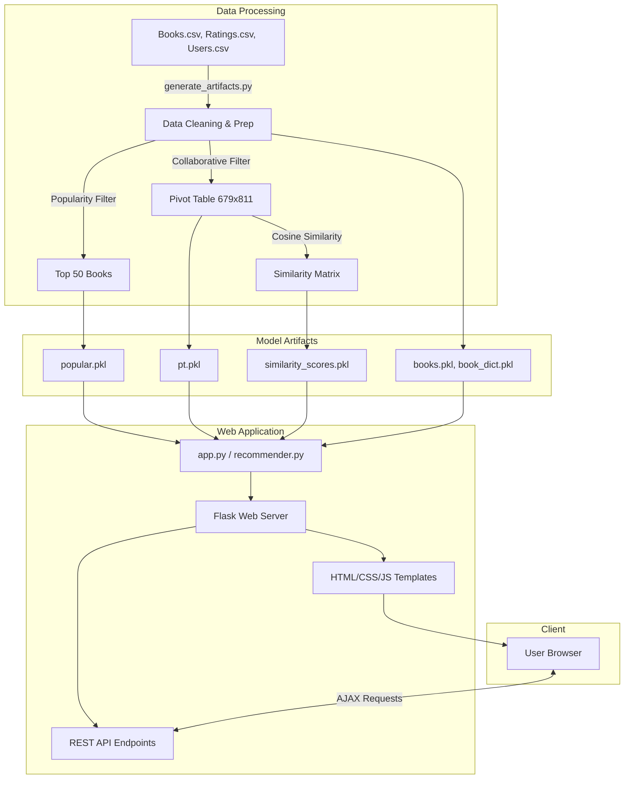

# BookVerse - Intelligent Book Recommender System

A modern, production-grade Web Application and Recommender System engineered with **Collaborative Filtering (Cosine Similarity)** and **Popularity-Based Ranking**, trained on **1.14+ Million reader ratings** across **271,000+ books** from the Book-Crossing dataset based on `Project_3.ipynb`.

---

## Key Features

### 1. Top 50 Most Popular Books
- Curated using a statistical threshold of at least **250 verified reader ratings** to eliminate statistical noise.
- Ranked by weighted average rating score.
- Displays high-resolution book covers, star ratings (out of 10), author, publication year, publisher, and total votes.
- Real-time client-side search/filter bar to filter top 50 books instantly.

### 2. Interactive Recommendation Studio
- Powered by **Item-Item Collaborative Filtering** using **Cosine Similarity** across a 679 &times; 811 reader pivot matrix.
- **Real-time Live Autocomplete Search**: Start typing any letter to get instant book suggestions with thumbnails.
- **Customizable Recommendations Count**: Select Top 4, 6, 8, 10, or 12 similar books.
- **Similarity Affinity Score Meter**: Displays match percentage (e.g., `94.2% Match`) with animated progress bars.
- **Deep Recommendation Chaining**: Click "Recommend Next" on any recommended book to immediately generate recommendations based on it.
- **"Surprise Me" Lucky Picker**: Randomly selects a classic from the collaborative matrix for quick inspiration.

### 3. Catalog Explorer (271,000+ Books)
- Search and browse through the entire catalog by title or author.
- Integrated pagination and quick book preview modal with Amazon & Goodreads links.

### 4. Personal Reading List / Bookmarks
- Bookmark favorite books with a single click.
- Stored locally in your browser session (`localStorage`).
- Interactive Bookshelf view with one-click recommendation links and text export.

### 5. Polished Modern Glassmorphism UI
- Seamless **Dark & Light Mode** toggle with local persistence.
- 3D card tilt & hover lift animations, glowing badges, and custom scrollbars.
- **Bulletproof Image Fallback**: Automatically renders an elegant SVG book cover placeholder with book title & author if external Amazon CDN images are blocked or missing.
- Global keyboard shortcut: `Ctrl + K` to focus search instantly.

---

## Project Architecture & Workflow



---

## How to Recreate the Models and Start the Server

Follow these steps to generate the machine learning models from scratch using your own data or the provided dataset, and then start the web server.

### 1. Prerequisites
Ensure you have Python 3.9 or higher installed on your system.

### 2. Install Dependencies
Install the required Python packages using pip:
```bash
pip install -r requirements.txt
```

### 3. Provide the Datasets
Ensure the following datasets (CSV format) are present in the root directory:
- `Books.csv`
- `Ratings.csv`
- `Users.csv`

### 4. Recreate the Model Artifacts
Run the artifact generation script. This will process the datasets, apply the collaborative filtering logic, compute the cosine similarity matrix, and generate the necessary `.pkl` files in the `model/` directory.

```bash
python generate_artifacts.py
```
*Note: This process may take a few minutes depending on your system's hardware.*

### 5. Start the Web Server
Once the model artifacts are successfully generated, you can start the Flask application server:

```bash
python app.py
```

### 6. Access the Application
Open your web browser and navigate to:
```
http://127.0.0.1:5000
```

---

## REST API Documentation

| Endpoint | Method | Description |
|---|---|---|
| `/api/recommend?book=<title>&top_n=<n>` | GET | Get top N recommendations for a book with similarity scores |
| `/api/search?q=<query>&limit=<n>` | GET | Autocomplete live search across titles and authors |
| `/api/popular?limit=50` | GET | Returns the Top 50 most popular books |
| `/api/random?count=6` | GET | Returns random famous books from the CF matrix |
| `/api/book/<title>` | GET | Returns full metadata for a specific book |
| `/api/stats` | GET | Returns summary dataset and model metrics |

---

## Machine Learning Methodology

1. **Popularity-Based Filtering**:
   $$\text{Threshold: } \text{Count}(\text{Ratings}) \ge 250$$
   Sorted descending by $\text{Mean}(\text{Rating})$, generating a robust cold-start Top 50 list.

2. **Collaborative Filtering Dimensionality Reduction**:
   - Filter active readers with $> 200$ ratings (811 users).
   - Filter famous books with $> 50$ ratings from active readers (679 books).
   - Construct Pivot Table $P_{679 \times 811}$.

3. **Cosine Similarity Vector Metric**:
   $$\text{Similarity}(A, B) = \frac{A \cdot B}{\|A\|_2 \|B\|_2} = \frac{\sum_{i=1}^{n} A_i B_i}{\sqrt{\sum_{i=1}^{n} A_i^2} \sqrt{\sum_{i=1}^{n} B_i^2}}$$
   Enables sub-millisecond retrieval of the closest books in reader vector space!
